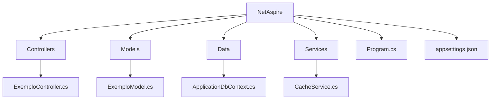
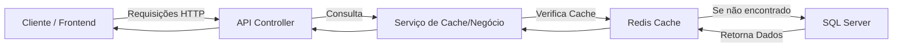

# 💻 NetAspire

> Projeto base em **.NET Aspire**, integrando SQL Server e Redis para alta performance, com exemplos práticos e boas práticas de desenvolvimento.


---

## 📘 Visão Geral

O **NetAspire** é um projeto base desenvolvido para fornecer:

* Integração com **SQL Server** para persistência de dados
* Uso de **Redis** para cache e otimização de performance
* Estrutura modular com **.NET 8** e **ASP.NET Core Web API**
* Exemplos práticos de **boas práticas em arquitetura, performance e escalabilidade**

Ideal para desenvolvedores que desejam:

* Criar APIs modernas e performáticas
* Integrar cache distribuído de forma simples
* Ter uma referência base para novos projetos corporativos

---

## 🧩 Estrutura do Projeto



**Destaques:**

* `Controllers` → Pontos de entrada da API
* `Data` → Contexto e mapeamento do EF Core
* `Models` → Classes representando entidades
* `Services` → Lógica de cache e serviços auxiliares

---

## 🧪 Tecnologias Utilizadas

| Tecnologia                | Descrição                                            |
| ------------------------- | ---------------------------------------------------- |
| **.NET 8**                | Plataforma de desenvolvimento moderna e performática |
| **ASP.NET Core Web API**  | Estrutura para APIs REST                             |
| **Entity Framework Core** | ORM para integração com SQL Server                   |
| **SQL Server**            | Banco de dados relacional                            |
| **Redis**                 | Cache distribuído para otimização de performance     |
| **Docker**                | Opcional, facilita configuração do ambiente          |

---

## ⚙️ Pré-requisitos

Antes de iniciar, garanta que possui instalado:

* ✅ [Visual Studio 2022](https://visualstudio.microsoft.com/) ou [VS Code](https://code.visualstudio.com/)
* ✅ [.NET 8 SDK](https://dotnet.microsoft.com/download/dotnet/8.0)
* ✅ SQL Server (local ou container)
* ✅ Redis (local ou container)

---

## 🚀 Como Executar Localmente

### 1. Clone o repositório

```bash
git clone https://github.com/thiagodsantana/NetAspire.git
cd NetAspire
```

### 2. Configure o banco de dados

No arquivo `appsettings.json`, ajuste as strings de conexão:

```json
"ConnectionStrings": {
  "SqlServer": "Server=localhost;Database=NetAspireDB;User Id=sa;Password=SuaSenha123;",
  "Redis": "localhost:6379"
}
```

### 3. Execute a aplicação

```bash
dotnet run
```

A API estará disponível em `https://localhost:5001` ou `http://localhost:5000`.

---

## 🧱 Fluxo de Funcionamento



---

## 💡 Objetivo Educacional

Este projeto serve como base para:

* Construção de APIs modernas e escaláveis
* Aprendizado prático sobre **integração com bancos e cache distribuído**
* Referência para **boas práticas de arquitetura .NET**

---

## 📚 Boas Práticas e Recomendações

* Use **migrations do EF Core** para manter o banco atualizado
* Aproveite **Redis** para armazenar dados frequentemente acessados
* Escreva **testes unitários e de integração**
* Documente suas APIs com **Swagger** ou outra ferramenta equivalente

---

## 🤝 Contribuindo

1. Faça um *fork* do projeto
2. Crie uma branch: `git checkout -b feature/nova-funcionalidade`
3. Adicione código e exemplos
4. Commit: `git commit -m "Adiciona funcionalidade X"`
5. Envie: `git push origin feature/nova-funcionalidade`
6. Abra um *Pull Request*

---

## 🪪 Licença

Este projeto está sob a licença **MIT** — livre para uso, estudo e modificação.

---

## ✉️ Contato

**Autor:** [Thiago D. Santana](https://github.com/thiagodsantana)
**LinkedIn:** [linkedin.com/in/thiagodsantana](https://linkedin.com/in/thiagodsantana)
**E-mail:** [thiago.darley@gmail.com](mailto:thiago.darley@gmail.com)
